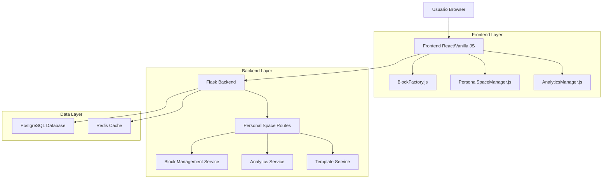
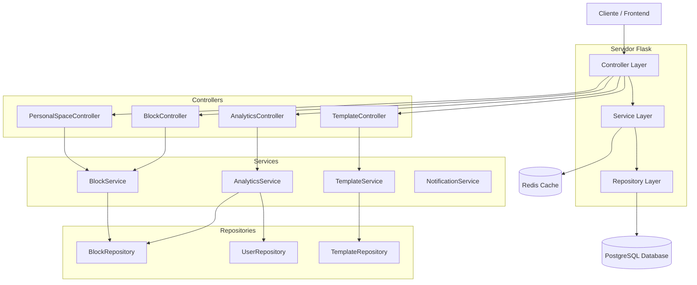
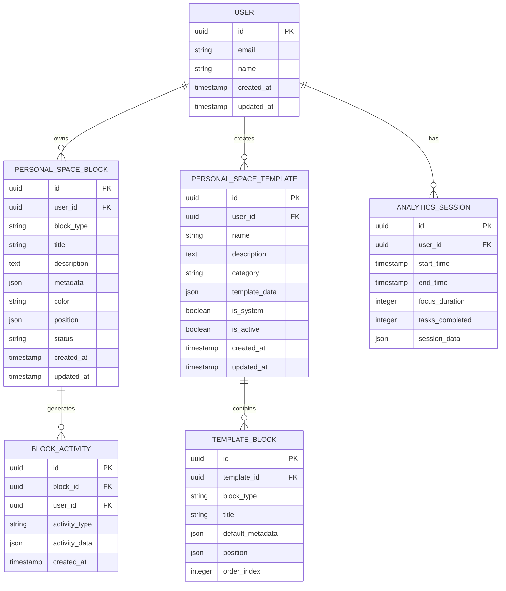

# Arquitectura Técnica: Personal Space CRUNEVO - Solución Completa

## 1. Diseño de Arquitectura



## 2. Descripción de Tecnologías

* **Frontend**: Vanilla JavaScript + Jinja2 Templates + TailwindCSS

* **Backend**: Flask + SQLAlchemy + Flask-Login

* **Base de Datos**: PostgreSQL (existente)

* **Cache**: Redis (para sesiones y datos temporales)

* **Librerías JS**: SortableJS, Chart.js (para analytics)

## 3. Definiciones de Rutas

| Ruta                        | Propósito                                  |
| --------------------------- | ------------------------------------------ |
| `/personal-space/`          | Página principal del Personal Space        |
| `/personal-space/workspace` | Vista de workspace con bloques del usuario |
| `/personal-space/analytics` | Página de analytics con métricas reales    |
| `/personal-space/settings`  | Configuración del Personal Space           |

## 4. Definiciones de API

### 4.1 API Core - Gestión de Bloques

#### Crear Bloque

```
POST /api/personal-space/blocks
```

**Request:**

| Param Name  | Param Type | isRequired | Description                                                     |
| ----------- | ---------- | ---------- | --------------------------------------------------------------- |
| block\_type | string     | true       | Tipo de bloque (task, note, kanban, objective, calendar, habit) |
| title       | string     | true       | Título del bloque                                               |
| description | string     | false      | Descripción del bloque                                          |
| metadata    | object     | false      | Metadatos específicos del tipo de bloque                        |
| color       | string     | false      | Color del bloque (hex)                                          |
| position    | object     | false      | Posición en el workspace {x, y}                                 |

**Response:**

| Param Name | Param Type | Description             |
| ---------- | ---------- | ----------------------- |
| success    | boolean    | Estado de la operación  |
| block      | object     | Datos del bloque creado |
| message    | string     | Mensaje de confirmación |

**Ejemplo Request:**

```json
{
  "block_type": "task",
  "title": "Mi nueva tarea",
  "description": "Descripción de la tarea",
  "metadata": {
    "priority": "high",
    "due_date": "2024-01-15",
    "tags": ["trabajo", "urgente"]
  },
  "color": "#3B82F6",
  "position": {"x": 0, "y": 0}
}
```

**Ejemplo Response:**

```json
{
  "success": true,
  "block": {
    "id": "550e8400-e29b-41d4-a716-446655440000",
    "block_type": "task",
    "title": "Mi nueva tarea",
    "description": "Descripción de la tarea",
    "metadata": {
      "priority": "high",
      "due_date": "2024-01-15",
      "tags": ["trabajo", "urgente"]
    },
    "color": "#3B82F6",
    "position": {"x": 0, "y": 0},
    "status": "active",
    "created_at": "2024-01-10T10:30:00Z",
    "updated_at": "2024-01-10T10:30:00Z"
  },
  "message": "Bloque creado exitosamente"
}
```

#### Obtener Bloques del Usuario

```
GET /api/personal-space/blocks
```

**Query Parameters:**

| Param Name | Param Type | isRequired | Description                                    |
| ---------- | ---------- | ---------- | ---------------------------------------------- |
| status     | string     | false      | Filtrar por estado (active, archived, deleted) |
| type       | string     | false      | Filtrar por tipo de bloque                     |
| limit      | integer    | false      | Límite de resultados (default: 50)             |
| offset     | integer    | false      | Offset para paginación (default: 0)            |

**Response:**

```json
{
  "success": true,
  "blocks": [
    {
      "id": "550e8400-e29b-41d4-a716-446655440000",
      "block_type": "task",
      "title": "Mi tarea",
      "status": "active",
      "created_at": "2024-01-10T10:30:00Z"
    }
  ],
  "total": 1,
  "has_more": false
}
```

#### Actualizar Bloque

```
PUT /api/personal-space/blocks/<block_id>
```

**Request:** (Mismos campos que POST, todos opcionales)

**Response:** (Mismo formato que POST)

#### Eliminar Bloque

```
DELETE /api/personal-space/blocks/<block_id>
```

**Response:**

```json
{
  "success": true,
  "message": "Bloque eliminado exitosamente"
}
```

### 4.2 API Analytics

#### Obtener Estadísticas Generales

```
GET /api/personal-space/stats
```

**Response:**

```json
{
  "success": true,
  "stats": {
    "total_tasks": 15,
    "total_objectives": 3,
    "productive_hours": 24.5,
    "completed_tasks_today": 5,
    "active_projects": 2,
    "completion_rate": 78.5
  }
}
```

#### Obtener Analytics Detallados

```
GET /api/personal-space/analytics
```

**Query Parameters:**

| Param Name  | Param Type | isRequired | Description                                      |
| ----------- | ---------- | ---------- | ------------------------------------------------ |
| timeframe   | string     | false      | Período (day, week, month, year) - default: week |
| start\_date | string     | false      | Fecha inicio (ISO format)                        |
| end\_date   | string     | false      | Fecha fin (ISO format)                           |

**Response:**

```json
{
  "success": true,
  "analytics": {
    "timeframe": "week",
    "period": {
      "start": "2024-01-08T00:00:00Z",
      "end": "2024-01-14T23:59:59Z"
    },
    "metrics": {
      "tasks_completed": 12,
      "tasks_created": 15,
      "objectives_achieved": 1,
      "productive_hours": 32.5,
      "focus_sessions": 8
    },
    "charts": {
      "daily_productivity": [
        {"date": "2024-01-08", "hours": 4.5, "tasks": 2},
        {"date": "2024-01-09", "hours": 6.0, "tasks": 3}
      ],
      "task_completion_rate": [
        {"date": "2024-01-08", "completed": 2, "total": 3},
        {"date": "2024-01-09", "completed": 3, "total": 4}
      ]
    }
  }
}
```

### 4.3 API Plantillas

#### Obtener Plantillas Disponibles

```
GET /api/personal-space/templates
```

**Query Parameters:**

| Param Name | Param Type | isRequired | Description                 |
| ---------- | ---------- | ---------- | --------------------------- |
| category   | string     | false      | Filtrar por categoría       |
| user\_only | boolean    | false      | Solo plantillas del usuario |

**Response:**

```json
{
  "success": true,
  "templates": [
    {
      "id": "template_001",
      "name": "Gestión de Proyecto",
      "description": "Plantilla para gestionar proyectos con tareas y objetivos",
      "category": "productivity",
      "is_system": true,
      "preview_image": "/static/images/templates/project-management.png",
      "blocks": [
        {
          "type": "objective",
          "title": "Objetivo del Proyecto",
          "position": {"x": 0, "y": 0}
        },
        {
          "type": "kanban",
          "title": "Tareas del Proyecto",
          "position": {"x": 1, "y": 0}
        }
      ]
    }
  ]
}
```

#### Crear Bloque desde Plantilla

```
POST /api/personal-space/templates/<template_id>/apply
```

**Request:**

| Param Name     | Param Type | isRequired | Description                 |
| -------------- | ---------- | ---------- | --------------------------- |
| customizations | object     | false      | Personalizaciones a aplicar |

**Response:**

```json
{
  "success": true,
  "blocks": [
    {
      "id": "550e8400-e29b-41d4-a716-446655440001",
      "block_type": "objective",
      "title": "Objetivo del Proyecto"
    },
    {
      "id": "550e8400-e29b-41d4-a716-446655440002",
      "block_type": "kanban",
      "title": "Tareas del Proyecto"
    }
  ],
  "message": "Plantilla aplicada exitosamente"
}
```

## 5. Arquitectura del Servidor



## 6. Modelo de Datos

### 6.1 Diagrama de Entidades



### 6.2 Definición de Tablas (DDL)

#### Tabla de Bloques del Personal Space

```sql
-- Crear tabla de bloques
CREATE TABLE personal_space_blocks (
    id UUID PRIMARY KEY DEFAULT gen_random_uuid(),
    user_id UUID NOT NULL REFERENCES users(id) ON DELETE CASCADE,
    block_type VARCHAR(50) NOT NULL CHECK (block_type IN ('task', 'note', 'kanban', 'objective', 'calendar', 'habit')),
    title VARCHAR(255) NOT NULL,
    description TEXT,
    metadata JSONB DEFAULT '{}',
    color VARCHAR(7) DEFAULT '#3B82F6',
    position JSONB DEFAULT '{"x": 0, "y": 0}',
    status VARCHAR(20) DEFAULT 'active' CHECK (status IN ('active', 'archived', 'deleted')),
    created_at TIMESTAMP WITH TIME ZONE DEFAULT NOW(),
    updated_at TIMESTAMP WITH TIME ZONE DEFAULT NOW()
);

-- Crear índices
CREATE INDEX idx_personal_space_blocks_user_id ON personal_space_blocks(user_id);
CREATE INDEX idx_personal_space_blocks_type ON personal_space_blocks(block_type);
CREATE INDEX idx_personal_space_blocks_status ON personal_space_blocks(status);
CREATE INDEX idx_personal_space_blocks_created_at ON personal_space_blocks(created_at DESC);
CREATE INDEX idx_personal_space_blocks_metadata ON personal_space_blocks USING GIN(metadata);

-- Trigger para actualizar updated_at
CREATE OR REPLACE FUNCTION update_updated_at_column()
RETURNS TRIGGER AS $$
BEGIN
    NEW.updated_at = NOW();
    RETURN NEW;
END;
$$ language 'plpgsql';

CREATE TRIGGER update_personal_space_blocks_updated_at
    BEFORE UPDATE ON personal_space_blocks
    FOR EACH ROW
    EXECUTE FUNCTION update_updated_at_column();
```

#### Tabla de Plantillas

```sql
-- Crear tabla de plantillas
CREATE TABLE personal_space_templates (
    id UUID PRIMARY KEY DEFAULT gen_random_uuid(),
    user_id UUID REFERENCES users(id) ON DELETE CASCADE,
    name VARCHAR(255) NOT NULL,
    description TEXT,
    category VARCHAR(50) NOT NULL,
    template_data JSONB NOT NULL,
    is_system BOOLEAN DEFAULT FALSE,
    is_active BOOLEAN DEFAULT TRUE,
    created_at TIMESTAMP WITH TIME ZONE DEFAULT NOW(),
    updated_at TIMESTAMP WITH TIME ZONE DEFAULT NOW()
);

-- Crear índices
CREATE INDEX idx_personal_space_templates_user_id ON personal_space_templates(user_id);
CREATE INDEX idx_personal_space_templates_category ON personal_space_templates(category);
CREATE INDEX idx_personal_space_templates_is_system ON personal_space_templates(is_system);
CREATE INDEX idx_personal_space_templates_is_active ON personal_space_templates(is_active);

-- Trigger para updated_at
CREATE TRIGGER update_personal_space_templates_updated_at
    BEFORE UPDATE ON personal_space_templates
    FOR EACH ROW
    EXECUTE FUNCTION update_updated_at_column();
```

#### Tabla de Actividades de Bloques

```sql
-- Crear tabla de actividades
CREATE TABLE block_activities (
    id UUID PRIMARY KEY DEFAULT gen_random_uuid(),
    block_id UUID NOT NULL REFERENCES personal_space_blocks(id) ON DELETE CASCADE,
    user_id UUID NOT NULL REFERENCES users(id) ON DELETE CASCADE,
    activity_type VARCHAR(50) NOT NULL CHECK (activity_type IN ('created', 'updated', 'completed', 'archived', 'deleted', 'viewed')),
    activity_data JSONB DEFAULT '{}',
    created_at TIMESTAMP WITH TIME ZONE DEFAULT NOW()
);

-- Crear índices
CREATE INDEX idx_block_activities_block_id ON block_activities(block_id);
CREATE INDEX idx_block_activities_user_id ON block_activities(user_id);
CREATE INDEX idx_block_activities_type ON block_activities(activity_type);
CREATE INDEX idx_block_activities_created_at ON block_activities(created_at DESC);
```

#### Tabla de Sesiones de Analytics

```sql
-- Crear tabla de sesiones de analytics
CREATE TABLE analytics_sessions (
    id UUID PRIMARY KEY DEFAULT gen_random_uuid(),
    user_id UUID NOT NULL REFERENCES users(id) ON DELETE CASCADE,
    start_time TIMESTAMP WITH TIME ZONE NOT NULL,
    end_time TIMESTAMP WITH TIME ZONE,
    focus_duration INTEGER DEFAULT 0, -- en minutos
    tasks_completed INTEGER DEFAULT 0,
    session_data JSONB DEFAULT '{}',
    created_at TIMESTAMP WITH TIME ZONE DEFAULT NOW()
);

-- Crear índices
CREATE INDEX idx_analytics_sessions_user_id ON analytics_sessions(user_id);
CREATE INDEX idx_analytics_sessions_start_time ON analytics_sessions(start_time DESC);
CREATE INDEX idx_analytics_sessions_end_time ON analytics_sessions(end_time DESC);
```

#### Datos Iniciales

```sql
-- Insertar plantillas del sistema
INSERT INTO personal_space_templates (user_id, name, description, category, template_data, is_system, is_active) VALUES
(NULL, 'Gestión de Proyecto', 'Plantilla completa para gestionar proyectos con objetivos y tareas', 'productivity', 
 '{
   "blocks": [
     {
       "type": "objective",
       "title": "Objetivo del Proyecto",
       "position": {"x": 0, "y": 0},
       "metadata": {"priority": "high"}
     },
     {
       "type": "kanban",
       "title": "Tareas del Proyecto",
       "position": {"x": 1, "y": 0},
       "metadata": {"columns": ["Por Hacer", "En Progreso", "Completado"]}
     }
   ]
 }', TRUE, TRUE),

(NULL, 'Planificación Semanal', 'Organiza tu semana con objetivos y seguimiento de hábitos', 'organization',
 '{
   "blocks": [
     {
       "type": "calendar",
       "title": "Calendario Semanal",
       "position": {"x": 0, "y": 0}
     },
     {
       "type": "habit",
       "title": "Hábitos Semanales",
       "position": {"x": 1, "y": 0}
     },
     {
       "type": "note",
       "title": "Notas de la Semana",
       "position": {"x": 0, "y": 1}
     }
   ]
 }', TRUE, TRUE),

(NULL, 'Espacio de Trabajo Simple', 'Configuración básica con notas y tareas', 'basic',
 '{
   "blocks": [
     {
       "type": "note",
       "title": "Notas Rápidas",
       "position": {"x": 0, "y": 0}
     },
     {
       "type": "task",
       "title": "Lista de Tareas",
       "position": {"x": 1, "y": 0}
     }
   ]
 }', TRUE, TRUE);
```

## 7. Configuración de Seguridad

### 7.1 Autenticación y Autorización

```python
# Decorador para verificar acceso a bloques
def require_block_access(f):
    @wraps(f)
    def decorated_function(*args, **kwargs):
        block_id = kwargs.get('block_id')
        if block_id:
            block = PersonalSpaceBlock.query.filter_by(
                id=block_id, 
                user_id=current_user.id
            ).first()
            if not block:
                return jsonify({
                    "success": False,
                    "error": "Bloque no encontrado o sin permisos"
                }), 404
        return f(*args, **kwargs)
    return decorated_function
```

### 7.2 Validación de Datos

```python
# Esquemas de validación con marshmallow
from marshmallow import Schema, fields, validate

class BlockCreateSchema(Schema):
    block_type = fields.Str(required=True, validate=validate.OneOf([
        'task', 'note', 'kanban', 'objective', 'calendar', 'habit'
    ]))
    title = fields.Str(required=True, validate=validate.Length(min=1, max=255))
    description = fields.Str(missing='', validate=validate.Length(max=1000))
    metadata = fields.Dict(missing={})
    color = fields.Str(missing='#3B82F6', validate=validate.Regexp(r'^#[0-9A-Fa-f]{6}$'))
    position = fields.Dict(missing={'x': 0, 'y': 0})
```

## 8. Monitoreo y Logging

### 8.1 Logs de Aplicación

```python
import logging
from flask import current_app

# Configurar logging para Personal Space
logger = logging.getLogger('personal_space')

def log_block_activity(user_id, block_id, activity_type, details=None):
    """Registrar actividad de bloques para analytics y debugging."""
    logger.info(f"Block activity: user={user_id}, block={block_id}, type={activity_type}", 
                extra={'details': details})
```

### 8.2 Métricas de Rendimiento

```python
from time import time
from functools import wraps

def monitor_performance(f):
    @wraps(f)
    def decorated_function(*args, **kwargs):
        start_time = time()
        result = f(*args, **kwargs)
        end_time = time()
        
        # Log tiempo de ejecución
        logger.info(f"Performance: {f.__name__} took {end_time - start_time:.2f}s")
        return result
    return decorated_function
```

***

**Documento creado**: $(date)
**Versión**: 1.0
**Estado**: Listo para implementación
