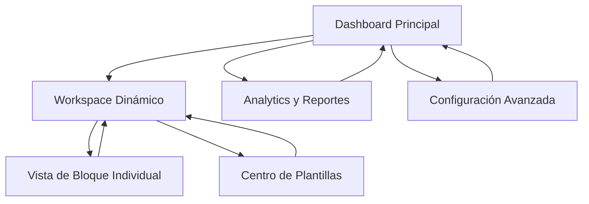

# Rediseño del Sistema Personal Space - Documento de Requerimientos de Producto

## 1. Resumen del Proyecto

Rediseño completo del sistema Personal Space de Crunevo2 para crear una experiencia de gestión académica moderna, modular y escalable. El sistema actual presenta bloques dispersos, vistas inconsistentes y componentes poco reutilizables que requieren una arquitectura completamente nueva.

**Objetivo Principal:** Transformar el Personal Space en un hub centralizado de productividad académica con componentes modulares, interfaz moderna y experiencia de usuario fluida.

**Valor del Mercado:** Posicionar Crunevo2 como la plataforma líder en gestión académica personal con herramientas integradas de productividad.

## 2. Funcionalidades Principales

### 2.1 Roles de Usuario

| Rol | Método de Registro | Permisos Principales |
|-----|-------------------|---------------------|
| Estudiante | Registro con email institucional | Crear, editar y gestionar todos los bloques personales |
| Estudiante Premium | Upgrade mediante suscripción | Acceso a plantillas avanzadas, analytics y sincronización |
| Administrador | Acceso por invitación | Gestión de plantillas globales y configuraciones del sistema |

### 2.2 Módulos de Funcionalidad

Nuestro sistema rediseñado consta de las siguientes páginas principales:

1. **Dashboard Principal**: Centro de control con métricas, acciones rápidas y vista general de bloques
2. **Workspace Dinámico**: Área de trabajo principal con sistema de bloques modulares y drag-and-drop
3. **Vista de Bloque Individual**: Páginas especializadas para cada tipo de bloque con herramientas específicas
4. **Centro de Plantillas**: Biblioteca de plantillas predefinidas y personalizadas
5. **Analytics y Reportes**: Dashboard de productividad con métricas y tendencias
6. **Configuración Avanzada**: Panel de personalización y preferencias del usuario

### 2.3 Detalles de Páginas

| Página | Módulo | Descripción de Funcionalidad |
|--------|--------|------------------------------|
| Dashboard Principal | Hero Section | Mostrar métricas de productividad, próximas fechas límite y accesos rápidos |
| Dashboard Principal | Quick Actions | Crear bloques rápidos, acceder a calendario y estadísticas |
| Dashboard Principal | Recent Activity | Mostrar actividad reciente y bloques modificados |
| Workspace Dinámico | Block Grid | Sistema de cuadrícula responsiva con drag-and-drop para reordenar bloques |
| Workspace Dinámico | Block Factory | Modal unificado para crear cualquier tipo de bloque con asistente |
| Workspace Dinámico | Filter System | Filtros avanzados por tipo, prioridad, fecha y etiquetas |
| Vista de Bloque | Block Editor | Editor contextual específico para cada tipo de bloque |
| Vista de Bloque | Collaboration Tools | Compartir, comentar y vincular bloques con recursos externos |
| Vista de Bloque | Version History | Historial de cambios y capacidad de restaurar versiones |
| Centro de Plantillas | Template Gallery | Galería de plantillas categorizadas con preview y ratings |
| Centro de Plantillas | Custom Templates | Crear y gestionar plantillas personalizadas |
| Analytics | Productivity Dashboard | Métricas de productividad, tiempo dedicado y tendencias |
| Analytics | Goal Tracking | Seguimiento de objetivos con visualizaciones de progreso |
| Configuración | Theme Customization | Personalizar colores, tipografías y layout |
| Configuración | Integration Settings | Configurar integraciones con calendarios y herramientas externas |

## 3. Flujo Principal de Usuario

**Flujo del Estudiante:**
1. Accede al Dashboard Principal y revisa métricas de productividad
2. Navega al Workspace Dinámico para gestionar bloques
3. Crea nuevos bloques usando el Block Factory o plantillas
4. Organiza bloques mediante drag-and-drop en la cuadrícula
5. Accede a vistas individuales para edición detallada
6. Revisa progreso en Analytics y ajusta objetivos

**Flujo del Administrador:**
1. Accede a configuración avanzada del sistema
2. Gestiona plantillas globales en el Centro de Plantillas
3. Configura integraciones y herramientas del sistema

## 4. Diseño de Interfaz de Usuario

### 4.1 Estilo de Diseño

- **Colores Primarios:** 
  - Índigo (#4F46E5) para elementos principales
  - Esmeralda (#10B981) para acciones positivas
  - Ámbar (#F59E0B) para alertas y notificaciones
  - Gris neutro (#6B7280) para texto secundario

- **Estilo de Botones:** Rounded corners (8px), gradientes sutiles, estados hover con elevación

- **Tipografía:** 
  - Fuente principal: Inter (16px base)
  - Títulos: Poppins (24px-32px)
  - Código: JetBrains Mono (14px)

- **Layout:** 
  - Grid system responsivo con breakpoints móviles
  - Sidebar colapsible con navegación contextual
  - Cards con sombras sutiles y bordes redondeados

- **Iconografía:** Bootstrap Icons con iconos personalizados para tipos de bloques específicos

### 4.2 Resumen de Diseño por Página

| Página | Módulo | Elementos de UI |
|--------|--------|----------------|
| Dashboard Principal | Hero Section | Cards con gradientes, métricas animadas, progress bars circulares |
| Dashboard Principal | Quick Actions | Botones flotantes, dropdown menus con iconos, tooltips informativos |
| Workspace Dinámico | Block Grid | Masonry layout responsivo, drag handles, zoom controls |
| Workspace Dinámico | Block Factory | Modal step-by-step, form validation en tiempo real, preview dinámico |
| Vista de Bloque | Block Editor | Toolbar contextual, editor WYSIWYG, panel lateral de propiedades |
| Centro de Plantillas | Template Gallery | Grid de cards con hover effects, filtros laterales, search bar |
| Analytics | Productivity Dashboard | Charts interactivos, KPI cards, timeline de actividad |
| Configuración | Theme Customization | Color picker, live preview, preset themes |

### 4.3 Responsividad

Diseño mobile-first con adaptación progresiva:
- **Móvil (320px-768px):** Stack vertical, navegación por tabs, gestos touch
- **Tablet (768px-1024px):** Grid de 2 columnas, sidebar colapsible
- **Desktop (1024px+):** Grid completo, múltiples paneles, atajos de teclado

Optimización para interacciones táctiles en dispositivos móviles con áreas de toque de mínimo 44px.