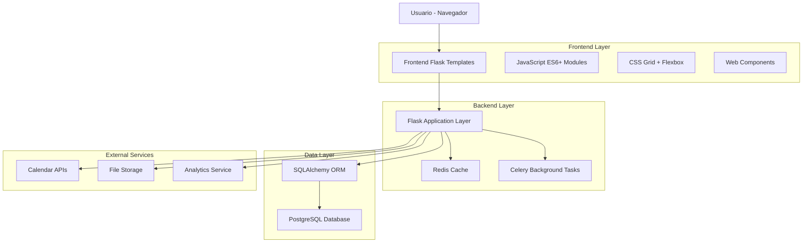
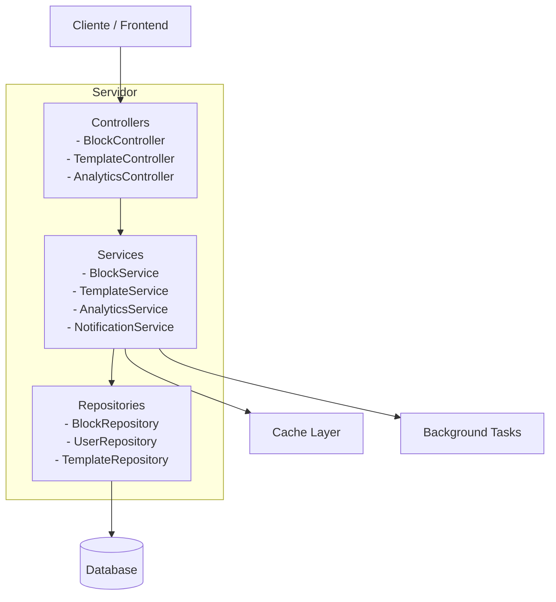
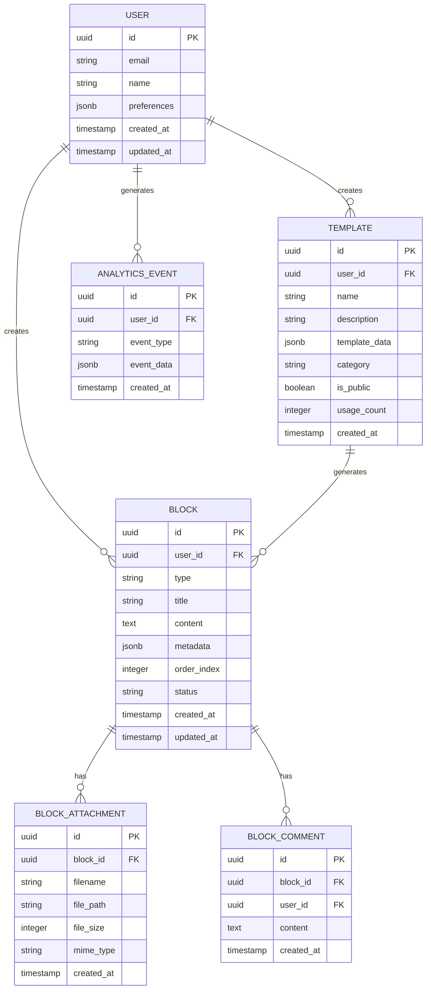

# Arquitectura Técnica del Sistema Personal Space Rediseñado

## 1. Diseño de Arquitectura



## 2. Descripción de Tecnologías

* **Frontend:** Flask Templates + Jinja2 + Bootstrap 5 + JavaScript ES6+ + CSS Grid

* **Backend:** Flask + SQLAlchemy + Redis + Celery

* **Base de Datos:** PostgreSQL con extensiones JSON

* **Cache:** Redis para sesiones y datos temporales

* **Tareas Asíncronas:** Celery para procesamiento en background

## 3. Definiciones de Rutas

| Ruta                                  | Propósito                                          |
| ------------------------------------- | -------------------------------------------------- |
| `/personal-space`                     | Dashboard principal con métricas y accesos rápidos |
| `/personal-space/workspace`           | Workspace dinámico con grid de bloques             |
| `/personal-space/block/<int:id>`      | Vista individual de bloque con editor contextual   |
| `/personal-space/block/<int:id>/edit` | Modo de edición avanzada para bloques              |
| `/personal-space/templates`           | Centro de plantillas y galería                     |
| `/personal-space/analytics`           | Dashboard de analytics y métricas                  |
| `/personal-space/settings`            | Configuración y personalización                    |
| `/api/personal-space/blocks`          | API REST para operaciones CRUD de bloques          |
| `/api/personal-space/templates`       | API para gestión de plantillas                     |
| `/api/personal-space/analytics`       | API para datos de analytics                        |

## 4. Definiciones de API

### 4.1 API Principal de Bloques

**Gestión de bloques**

```
GET /api/personal-space/blocks
```

Request:

| Parámetro | Tipo    | Requerido | Descripción                                      |
| --------- | ------- | --------- | ------------------------------------------------ |
| type      | string  | false     | Filtrar por tipo de bloque                       |
| status    | string  | false     | Filtrar por estado (active, completed, archived) |
| limit     | integer | false     | Límite de resultados (default: 20)               |
| offset    | integer | false     | Offset para paginación                           |

Response:

| Parámetro | Tipo    | Descripción                  |
| --------- | ------- | ---------------------------- |
| blocks    | array   | Lista de bloques             |
| total     | integer | Total de bloques             |
| has\_more | boolean | Indica si hay más resultados |

Ejemplo:

```json
{
  "blocks": [
    {
      "id": 1,
      "type": "tarea",
      "title": "Estudiar para examen",
      "content": "Repasar capítulos 1-5",
      "metadata": {
        "priority": "alta",
        "due_date": "2024-01-15",
        "tags": ["matemáticas", "examen"]
      },
      "created_at": "2024-01-01T10:00:00Z",
      "updated_at": "2024-01-10T15:30:00Z"
    }
  ],
  "total": 25,
  "has_more": true
}
```

**Crear bloque**

```
POST /api/personal-space/blocks
```

Request:

| Parámetro | Tipo   | Requerido | Descripción                                          |
| --------- | ------ | --------- | ---------------------------------------------------- |
| type      | string | true      | Tipo de bloque (tarea, nota, kanban, objetivo, etc.) |
| title     | string | true      | Título del bloque                                    |
| content   | string | false     | Contenido del bloque                                 |
| metadata  | object | false     | Metadatos específicos del tipo                       |

**Actualizar bloque**

```
PUT /api/personal-space/blocks/{id}
```

**Eliminar bloque**

```
DELETE /api/personal-space/blocks/{id}
```

### 4.2 API de Plantillas

**Obtener plantillas**

```
GET /api/personal-space/templates
```

**Crear plantilla desde bloque**

```
POST /api/personal-space/templates
```

### 4.3 API de Analytics

**Obtener métricas de productividad**

```
GET /api/personal-space/analytics/productivity
```

**Obtener datos de progreso**

```
GET /api/personal-space/analytics/progress
```

## 5. Arquitectura del Servidor



## 6. Modelo de Datos

### 6.1 Definición del Modelo de Datos



### 6.2 Lenguaje de Definición de Datos (DDL)

**Tabla de Bloques Rediseñada**

```sql
-- Crear tabla de bloques con estructura mejorada
CREATE TABLE personal_space_blocks (
    id UUID PRIMARY KEY DEFAULT gen_random_uuid(),
    user_id UUID NOT NULL REFERENCES users(id) ON DELETE CASCADE,
    type VARCHAR(50) NOT NULL CHECK (type IN ('tarea', 'nota', 'kanban', 'objetivo', 'bitacora', 'enlace', 'frase', 'recordatorio', 'meta', 'lista', 'bloque_personalizado')),
    title VARCHAR(255) NOT NULL,
    content TEXT,
    metadata JSONB DEFAULT '{}',
    order_index INTEGER DEFAULT 0,
    status VARCHAR(20) DEFAULT 'active' CHECK (status IN ('active', 'completed', 'archived', 'deleted')),
    created_at TIMESTAMP WITH TIME ZONE DEFAULT NOW(),
    updated_at TIMESTAMP WITH TIME ZONE DEFAULT NOW()
);

-- Crear índices para optimización
CREATE INDEX idx_personal_space_blocks_user_id ON personal_space_blocks(user_id);
CREATE INDEX idx_personal_space_blocks_type ON personal_space_blocks(type);
CREATE INDEX idx_personal_space_blocks_status ON personal_space_blocks(status);
CREATE INDEX idx_personal_space_blocks_order ON personal_space_blocks(user_id, order_index);
CREATE INDEX idx_personal_space_blocks_metadata ON personal_space_blocks USING GIN(metadata);
CREATE INDEX idx_personal_space_blocks_updated_at ON personal_space_blocks(updated_at DESC);

-- Tabla de plantillas
CREATE TABLE personal_space_templates (
    id UUID PRIMARY KEY DEFAULT gen_random_uuid(),
    user_id UUID REFERENCES users(id) ON DELETE CASCADE,
    name VARCHAR(255) NOT NULL,
    description TEXT,
    template_data JSONB NOT NULL,
    category VARCHAR(100),
    is_public BOOLEAN DEFAULT FALSE,
    usage_count INTEGER DEFAULT 0,
    created_at TIMESTAMP WITH TIME ZONE DEFAULT NOW()
);

-- Tabla de adjuntos
CREATE TABLE personal_space_block_attachments (
    id UUID PRIMARY KEY DEFAULT gen_random_uuid(),
    block_id UUID NOT NULL REFERENCES personal_space_blocks(id) ON DELETE CASCADE,
    filename VARCHAR(255) NOT NULL,
    file_path VARCHAR(500) NOT NULL,
    file_size INTEGER,
    mime_type VARCHAR(100),
    created_at TIMESTAMP WITH TIME ZONE DEFAULT NOW()
);

-- Tabla de eventos de analytics
CREATE TABLE personal_space_analytics_events (
    id UUID PRIMARY KEY DEFAULT gen_random_uuid(),
    user_id UUID NOT NULL REFERENCES users(id) ON DELETE CASCADE,
    event_type VARCHAR(100) NOT NULL,
    event_data JSONB DEFAULT '{}',
    created_at TIMESTAMP WITH TIME ZONE DEFAULT NOW()
);

-- Datos iniciales de plantillas
INSERT INTO personal_space_templates (name, description, template_data, category, is_public) VALUES
('Tarea Básica', 'Plantilla simple para tareas', '{"type": "tarea", "metadata": {"priority": "media"}}', 'productividad', true),
('Nota de Estudio', 'Plantilla para notas académicas', '{"type": "nota", "metadata": {"category": "estudio", "tags": []}}', 'académico', true),
('Objetivo SMART', 'Plantilla para objetivos específicos', '{"type": "objetivo", "metadata": {"smart_criteria": {"specific": "", "measurable": "", "achievable": "", "relevant": "", "time_bound": ""}}}', 'metas', true);
```

